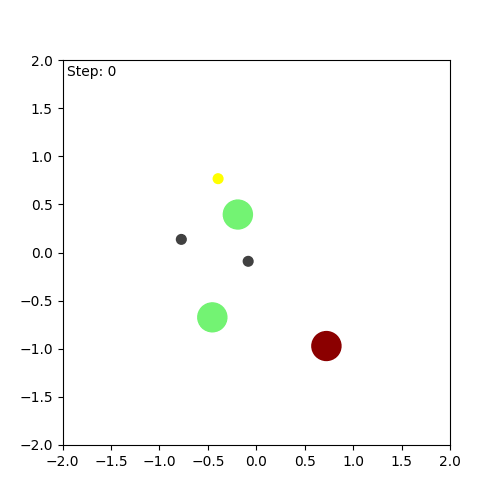
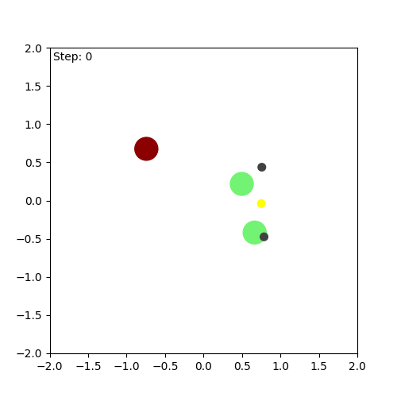
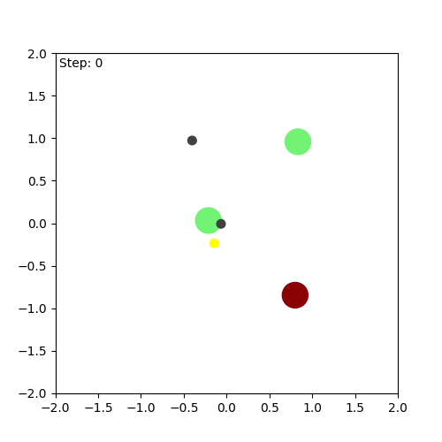
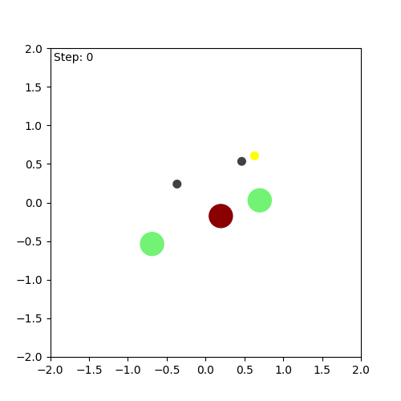

# A Principle of Pre-Strategy Intervention for Multi-Agent Reinforcement Learning

This repository contains the official JAX implementation for the NeurIPS 2025 paper: *A Principle of Pre-Strategy Intervention in Multi-Agent Reinforcement Learning*.


## Installation

This project requires Python 3.10 and uses `conda` for environment management.

1.  **Clone the repository:**
    ```shell
    git clone https://github.com/iamlilAJ/Pre-Strategy-Intervention.git
    cd Pre-Strategy-Intervention
    ```

2.  **Create and activate the conda environment:**
    ```shell
    conda create -n intervention python=3.10
    conda activate intervention
    ```

3.  **Install the project and dependencies:**
    This command will install the project in "editable" mode, which means that any changes you make to the local source code will be immediately reflected in your Python environment. This is the standard and recommended way to work with this project.
    ```shell
    pip install -e .[algs]
    ```

4.  **Install JAX with GPU support (Recommended):**
    We strongly recommend installing JAX according to your specific CUDA version by following the [official JAX installation guide](https://github.com/google/jax#installation). For example, for CUDA 12:
    ```shell
    pip install -U "jax[cuda12_pip]==0.4.25" -f https://storage.googleapis.com/jax-releases/jax_cuda_releases.html
    ```


### Hanabi

To run the IPPO
```shell
python baselines/IPPO/ippo_pre.py +alg=ippo
```

To change the scenarios
```shell
python baselines/IPPO/ippo_pre.py +alg=ippo baselines.ENV_KWARGS.convention_type=the_chop
```

To run the MAPPO
```shell
python baselines/MAPPO/mappo_pre.py +alg=mappo
```

PQN-VDN
```shell
python baselines/QLearning/pqn_vdn_pre.py +alg=pqn
```

PQN-IQ
```shell
python baselines/QLearning/pqn_iql_pre.py +alg=pqn
```

### MPE

IQL
```shell
python baselines/QLearning/iql_pre.py +alg=iql
```
To run the second scenario
```shell
python baselines/QLearning/iql_pre.py +alg=iql_scenario_2
```
VDN
```shell
python baselines/QLearning/vdn_pre.py + alg=vdn
```
QMIX
```shell
python baselines/QLearning/qmix_pre.py +alg=qmix
```

## Visualization of Learned Behavior


                                                                                                                           
|                |                                                       |                                                       |
| :------------- | :---------------------------------------------------: | :---------------------------------------------------: |
| **Our Method** |  |  |
| **Baseline** |  |  |

In this visualization, the green agent (our intervened agent) has learned a preference for moving towards the yellow landmark. By learning this simple additional desired outcome, the agent team can achieve effective coordination and successfully solve the task.

## License and Acknowledgements
This project is licensed under the Apache 2.0 License. See the LICENSE file for details.

Our implementation is built upon the excellent [JaxMARL](https://github.com/FLAIROx/JaxMARL) library. We thank the original authors for their significant contributions to the community.